# Vehicle Telemetry Visualisation — Low-Level Design (LLD)

| | |
|---|---|
| **Implements** | [telemetry-visualisation-spec.md](./telemetry-visualisation-spec.md) |
| **Delivery plan** | [telemetry-visualisation-plan.md](./telemetry-visualisation-plan.md) |
| **Scope** | Proof of concept. Simulated data only. Not production-grade. |
| **Diagrams** | [Mermaid](https://mermaid.js.org/) — render in GitHub and VS Code (Markdown Preview Mermaid support) |

Status legend used throughout: ✅ implemented (plan phases 0–2) · 🔲 designed, not yet implemented (phases 3–9).

---

## 1. Design overview

A FastAPI app hosts three things in one process: a background **simulator** that writes readings, a read-only **REST API**, and a static **dashboard** that polls the API. All persistence goes through one **service layer** onto SQLite.

### 1.1 Design principles

- **Strict layering** — `api/` (thin routes) → `services/` (logic) → `models/` (schemas + ORM + DB session). `config.py` is read by anyone; nobody reads the environment directly.
- **Validate at the boundary** — every reading passes through the Pydantic schema before storage; every query parameter is validated before it reaches a service.
- **Pure core, impure shell** — the simulator generator is deterministic (injected RNG); threading/async/DB live only in the runner.
- **Sync DB, async edge** — SQLAlchemy sessions are synchronous; async code calls them via `asyncio.to_thread`.

### 1.2 Package / module diagram

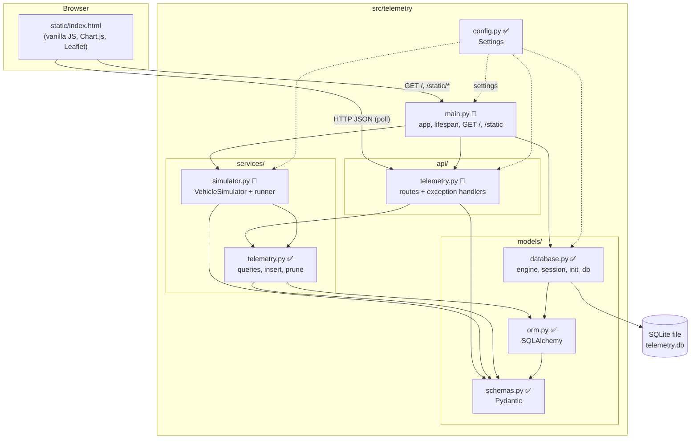

**Dependency rules** (enforced by review): `models` imports nothing from `services`/`api`; `services` never imports `api`; `api` never touches `ORM` or `Session` queries directly.

---

## 2. Class diagrams

### 2.1 Configuration and data model ✅

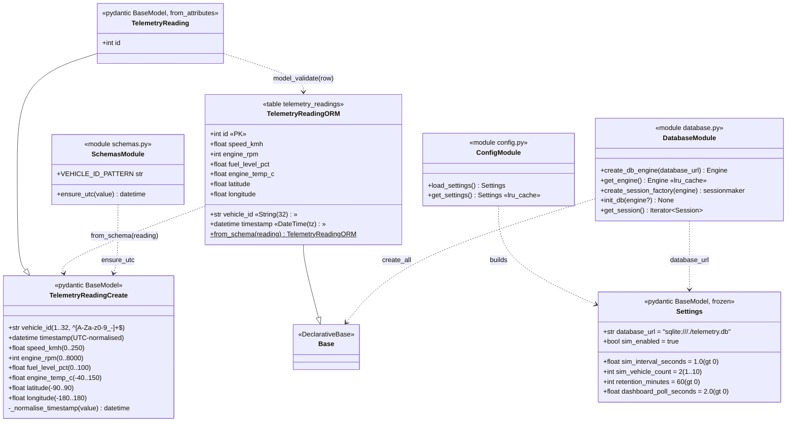

### 2.2 Service layer ✅

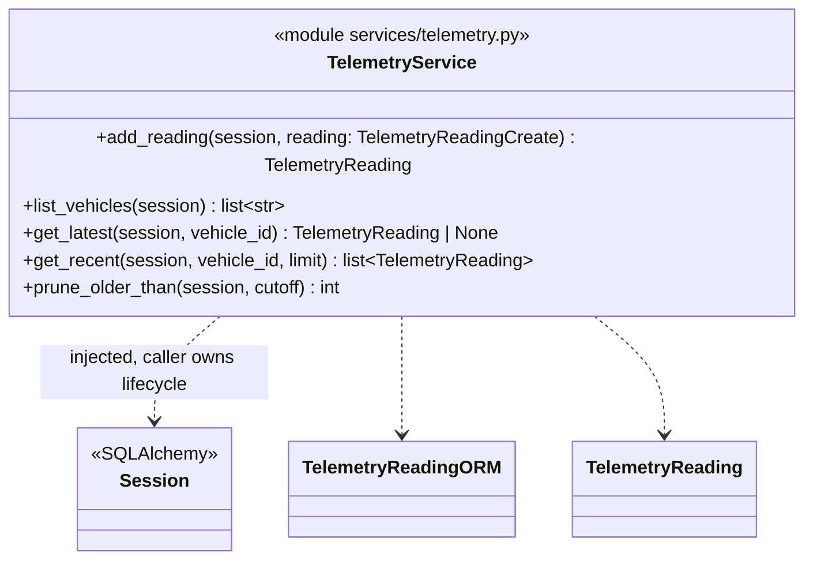

Contracts:

| Function | Ordering / semantics | Empty case |
|---|---|---|
| `add_reading` | Insert + commit, returns stored row with generated `id` | — |
| `list_vehicles` | `SELECT DISTINCT vehicle_id ORDER BY vehicle_id` | `[]` |
| `get_latest` | `ORDER BY timestamp DESC, id DESC LIMIT 1` | `None` |
| `get_recent` | Newest `limit` rows (`timestamp DESC, id DESC`), **reversed** to oldest→newest | `[]` |
| `prune_older_than` | `DELETE … WHERE timestamp < cutoff` (strict; boundary row kept), commit, returns deleted count; naive cutoff treated as UTC | `0` |

### 2.3 Simulator 🔲

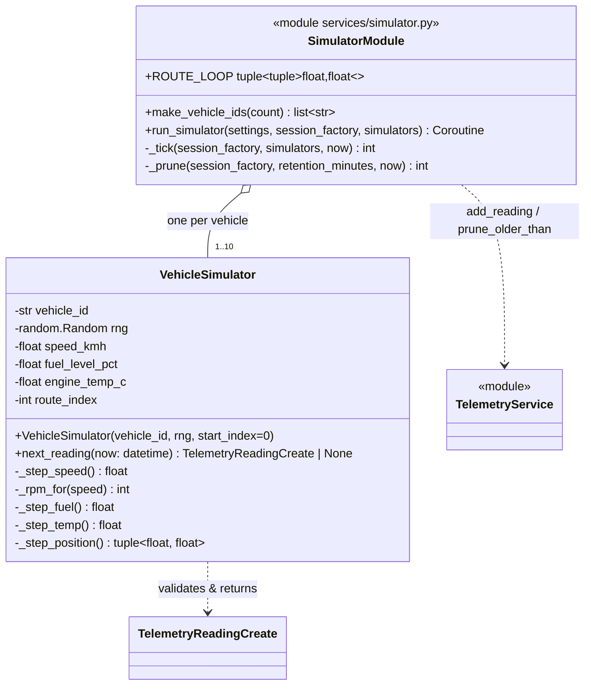

**Generator behaviour (`VehicleSimulator.next_reading`)**

| Field | Rule |
|---|---|
| `speed_kmh` | Bounded random walk: `speed += rng.uniform(-Δ, +Δ)`, clamped to `[0, 120]` (typical band, schema allows 250) |
| `engine_rpm` | `idle + speed * k + rng.gauss(0, σ)`, rounded and clamped to `[0, 8000]` |
| `fuel_level_pct` | `max(0, fuel − ε)` each tick — monotonic non-increasing, ≥ 0 |
| `engine_temp_c` | Exponential approach to ~90 °C plus small noise; starts ambient (~20 °C) |
| `latitude/longitude` | Advance `route_index` along `ROUTE_LOOP` (hardcoded fake coordinates in a generic location), wrap with `% len`; vehicles start at different offsets |
| `vehicle_id` | `make_vehicle_ids(n)` → `DEMO-VEH-001 … DEMO-VEH-00n` |

The reading is built with `TelemetryReadingCreate.model_validate(...)`; on `ValidationError` it returns `None` (the runner skips it). Same seed ⇒ same sequence; each vehicle owns independent state.

### 2.4 API layer 🔲

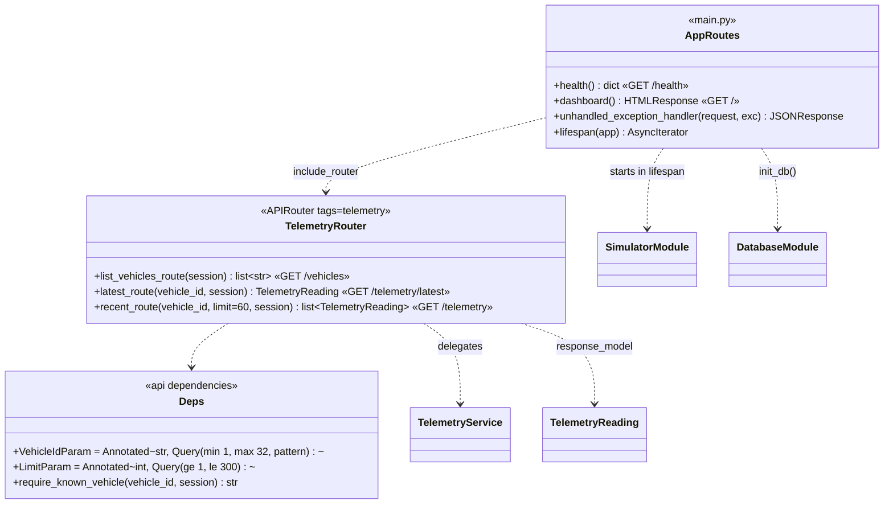

---

## 3. Database design ✅

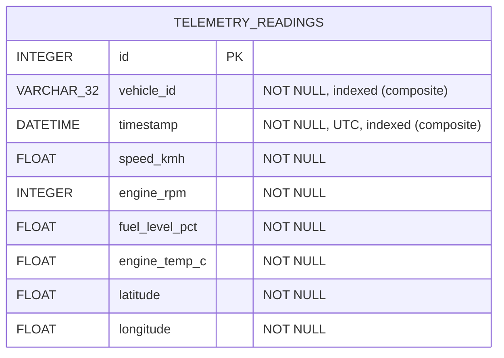

- Single table; vehicles are not a separate entity (the "known vehicles" set is `DISTINCT vehicle_id`).
- Index `ix_telemetry_vehicle_timestamp (vehicle_id, timestamp)` serves `get_latest`, `get_recent` and range pruning per vehicle.
- Row volume: `vehicle_count × 3600 / interval` ≈ 7 200 rows for the defaults (retention 60 min) — pruning keeps it bounded.
- File databases: `PRAGMA journal_mode=WAL` set in `init_db()` so simulator writes and API reads don't block each other; `check_same_thread=False` because `asyncio.to_thread` uses pool threads. In-memory databases use `StaticPool` so one connection is shared (tests).
- **Timestamps:** SQLite drops tzinfo. Writes are always UTC; `TelemetryReadingCreate` re-normalises (naive ⇒ UTC) on every read via `model_validate`.

---

## 4. Sequence diagrams

### 4.1 Application startup and shutdown 🔲

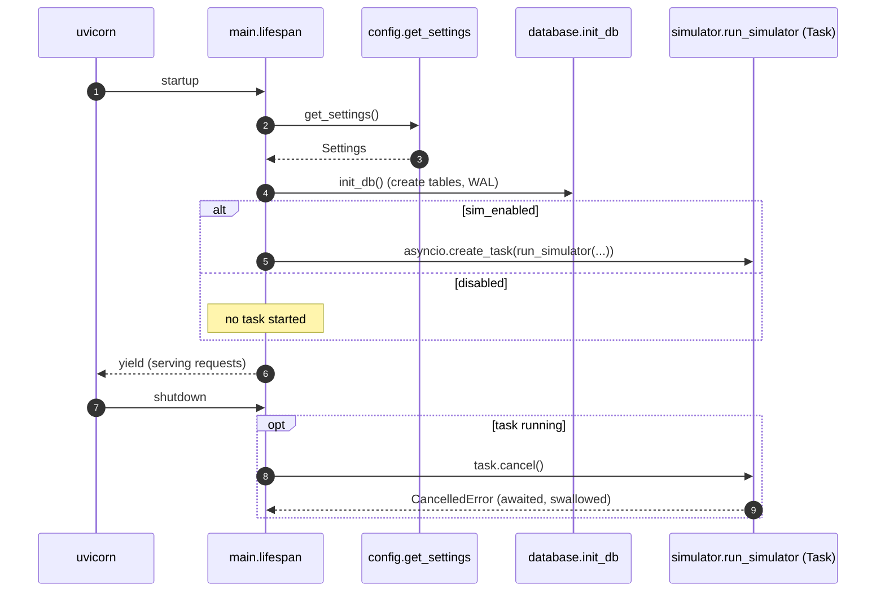

### 4.2 Simulator tick 🔲

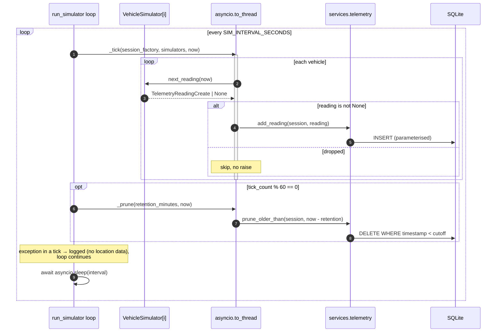

### 4.3 Dashboard poll (happy path) 🔲

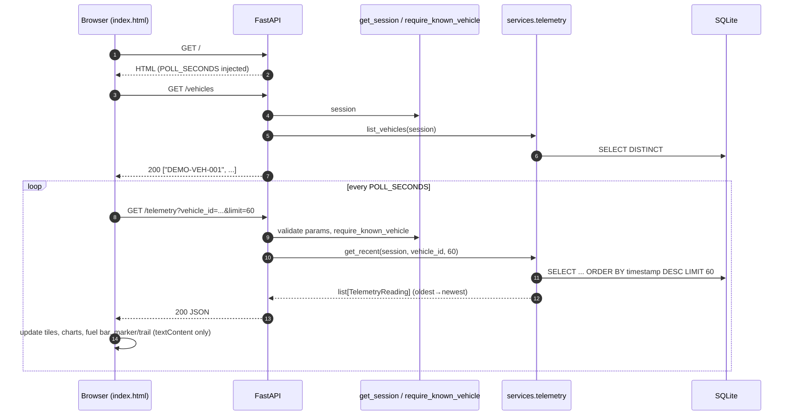

### 4.4 Error handling 🔲

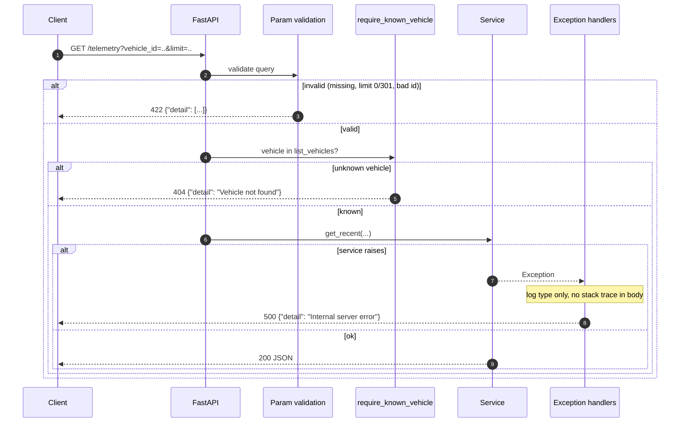

### 4.5 Dashboard connection-loss handling 🔲

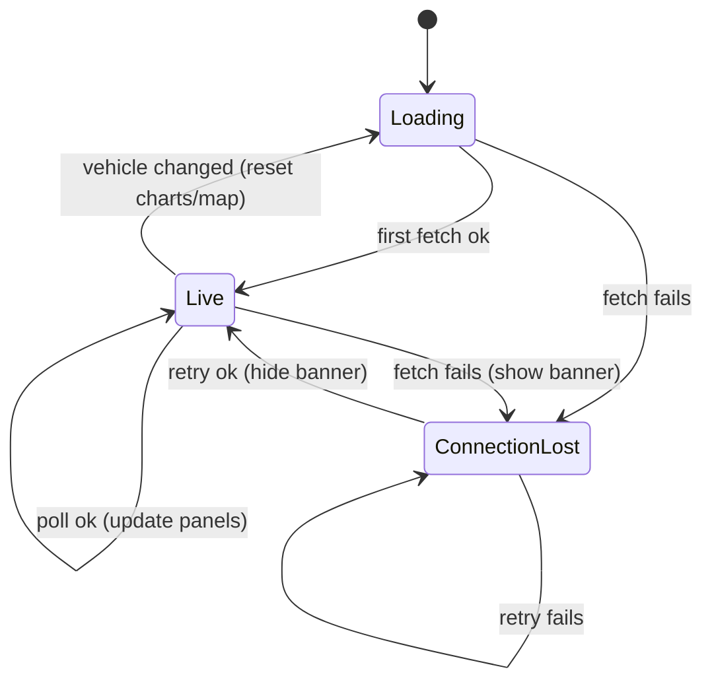

---

## 5. Activity diagram — building one simulated reading 🔲

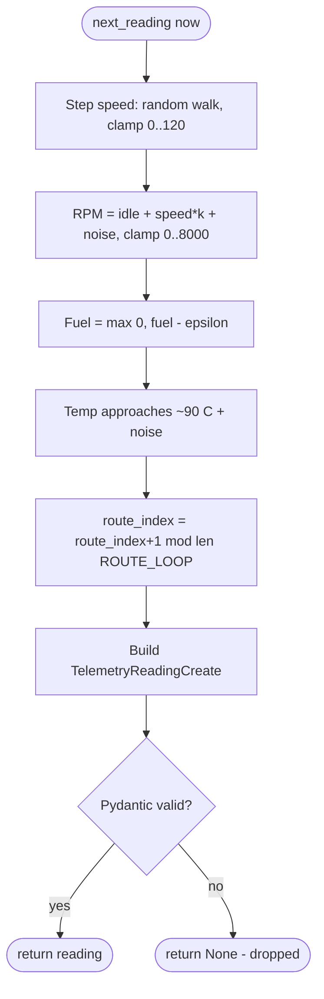

---

## 6. Component and deployment view

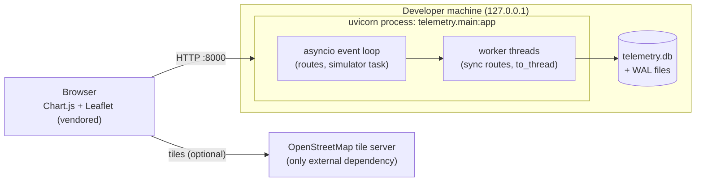

Run command: `uvicorn telemetry.main:app --app-dir src` (binds `127.0.0.1` by default; no CORS).

---

## 7. API specification 🔲

| Method & path | Params | Success | Errors |
|---|---|---|---|
| `GET /vehicles` | — | `200` `list[str]` | `500` |
| `GET /telemetry/latest` | `vehicle_id` (required, 1–32, `^[A-Za-z0-9_-]+$`) | `200` `TelemetryReading` | `404` unknown vehicle or no data; `422` invalid id |
| `GET /telemetry` | `vehicle_id` (as above), `limit` int 1–300, default 60 | `200` `list[TelemetryReading]` oldest→newest | `404` unknown vehicle; `422` invalid input |
| `GET /health` | — | `200` `{"status": "ok"}` | — |
| `GET /` | — | `200` `text/html` dashboard | — |
| `GET /static/*` | — | static assets (`StaticFiles`) | `404` |

Response shape (`TelemetryReading`):

```json
{
  "id": 1,
  "vehicle_id": "DEMO-VEH-001",
  "timestamp": "2026-01-01T12:00:00Z",
  "speed_kmh": 50.0,
  "engine_rpm": 2000,
  "fuel_level_pct": 75.0,
  "engine_temp_c": 90.0,
  "latitude": 10.0,
  "longitude": 20.0
}
```

Error bodies are always `{"detail": ...}`; the 500 body is the constant `"Internal server error"`.

**Route design notes**

- Routes are `async def` (per project rules) and stay thin: validated params → service call → return. Because the injected `Session` is synchronous, DB work in routes must not block the event loop: either the route calls the service through `run_in_threadpool`, or the sync service is exposed through a sync dependency. The chosen approach is to wrap service calls in `fastapi.concurrency.run_in_threadpool`.
- `require_known_vehicle` is an API dependency that checks `vehicle_id in list_vehicles(session)` and raises `HTTPException(404)`.
- **Open point:** `list_vehicles` is derived from stored readings, so a "known vehicle with no readings" (spec §16.2) cannot occur while it is DB-derived — such a vehicle is simply unknown and returns `404` on both routes. Making `/telemetry` return `[]` for a configured-but-empty vehicle would require validating against the configured IDs (`make_vehicle_ids(sim_vehicle_count)`) instead. Decide before Phase 5.

---

## 8. Dashboard design 🔲

### 8.1 Frontend modules (single `index.html`, inline JS)

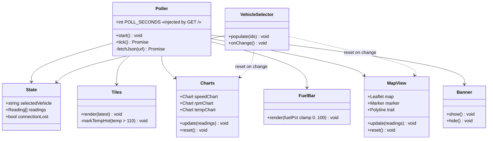

### 8.2 Panel data mapping

| Panel | Field(s) used | Update rule |
|---|---|---|
| Speed / RPM / Temp tiles | newest item's `speed_kmh`, `engine_rpm`, `engine_temp_c` | `textContent`; temp tile red when > 110 °C |
| Three line charts | last ≤ 60 readings, x = `timestamp`, y = metric | update datasets in place, animations off |
| Fuel bar | newest `fuel_level_pct` (clamped 0–100) | set bar width + label |
| Map | marker = newest lat/lon; trail = last ≤ 60 points | `setLatLng` / `setLatLngs`, auto-pan; tile failure tolerated |
| Status | fetch result | "● Live" vs "Connection lost" banner |

Rules: only `textContent` (never `innerHTML`); only the single poll call `/telemetry?limit=60`; all Chart.js/Leaflet assets are served from `/static/vendor/…`.

---

## 9. Cross-cutting design

### 9.1 Configuration

| Env var | Field | Default | Validation |
|---|---|---|---|
| `DATABASE_URL` | `database_url` | `sqlite:///./telemetry.db` | non-empty |
| `SIM_INTERVAL_SECONDS` | `sim_interval_seconds` | `1` | > 0 |
| `SIM_VEHICLE_COUNT` | `sim_vehicle_count` | `2` | 1–10 |
| `RETENTION_MINUTES` | `retention_minutes` | `60` | > 0 |
| `DASHBOARD_POLL_SECONDS` | `dashboard_poll_seconds` | `2` | > 0 |
| `SIM_ENABLED` | `sim_enabled` | `true` | bool |

`load_settings()` calls `load_dotenv()`, reads only those names, and validates via Pydantic; `get_settings()` caches the result (tests call `cache_clear()`).

### 9.2 Concurrency model

- One writer (simulator, via `to_thread`) and many readers (API). WAL allows concurrent read/write; transactions are one commit per call, kept short.
- Sessions are never shared across threads: the runner opens a session per tick/prune from `create_session_factory`; API requests get one per request from `get_session`.
- Shutdown: lifespan cancels the simulator task and awaits it; an in-flight DB call finishes inside its thread.

### 9.3 Error and logging policy

- Services raise ordinary exceptions; API turns expected cases into 404/422 and everything else into the generic 500 via a catch-all handler.
- Logs contain event type and counts only — **never** latitude/longitude, DB URLs with credentials, or stack traces in HTTP responses.

### 9.4 Security controls

| Concern | Control |
|---|---|
| Injection | ORM / bound parameters only; `vehicle_id` pattern-restricted; no `eval`/`exec` |
| XSS | `textContent` only; static gate test for `innerHTML` |
| Data privacy | Fake IDs and a generic fake route; no personal data |
| Secrets | None in code; `.env*` git-ignored, only `.env.example` committed |
| Network | Binds `127.0.0.1`; no CORS; no auth (non-goal) |
| Supply chain | Pinned MIT/Apache/BSD dependencies; vendored frontend libs with licences |

### 9.5 Extensibility notes (not in scope)

Swapping SQLite for another DB needs only `DATABASE_URL` (engine setup already branches on backend). WebSockets, alerts and export are explicit non-goals.

---

## 10. Traceability

| Design element | Spec | Plan phase | Status | Tests |
|---|---|---|---|---|
| `Settings`, `get_settings` | §9 | 1 | ✅ | `tests/test_config.py` |
| `TelemetryReading*` schemas | §5 | 1 | ✅ | `tests/models/test_schemas.py` |
| `TelemetryReadingORM` + index | §5 | 1 | ✅ | `tests/models/test_orm.py` |
| `database.py` (engine, WAL, session) | §3, risks | 1 | ✅ | `tests/models/test_database.py` |
| Telemetry service | §6, §16.2 | 2 | ✅ | `tests/services/test_telemetry.py` |
| `VehicleSimulator`, `make_vehicle_ids` | §8 | 3 | 🔲 | `tests/services/test_simulator.py` |
| Simulator runner + lifespan | §3, §16.7 | 4 | 🔲 | runner / lifespan tests |
| Routes, handlers, `/health` | §6, §16.2 | 5 | 🔲 | `tests/api/test_telemetry.py` |
| Dashboard shell | §7, §16.3–4 | 6 | 🔲 | `tests/api/test_dashboard.py` |
| Charts + fuel bar | §7 | 7 | 🔲 | dashboard + payload tests |
| Map | §7, §16.5 | 8 | 🔲 | dashboard asset tests |
